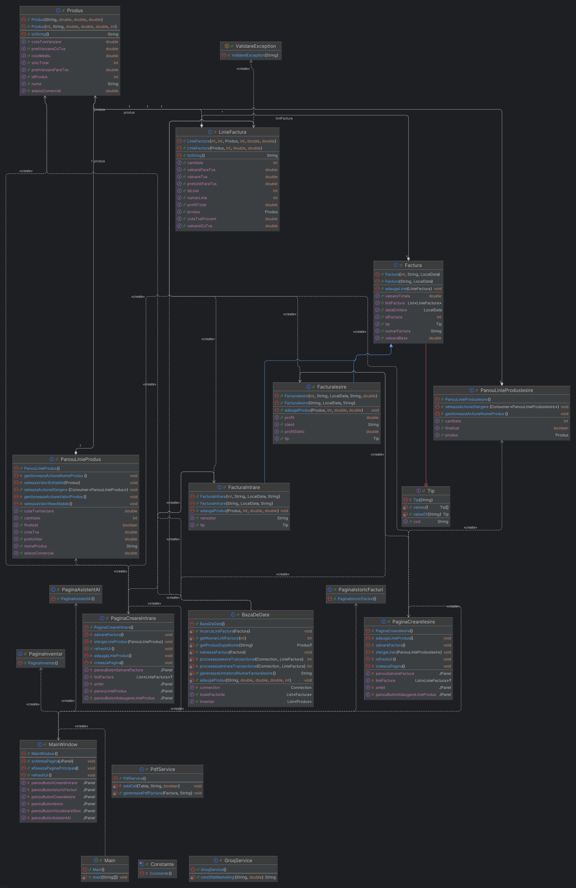
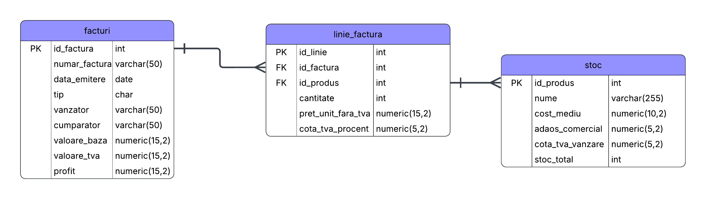

# Contabuild
### Petre-Mihai Unguroiu, Grupa 1, IR2

## Descriere
Acest proiect tine sa centralizeze o mare parte din activitatea contabila de la baza tuturor magazinelor/depozitelor. In general un contabil foloseste un program pentru a introduce facturile de intrare in gestiunea firmei, un altul pentru a inregistra facturile de iesire, si in mare timp un al treilea program pentru evaluarea gestiunii pentru o perioada specificata sau pentru vizualizarea stocului. Prin programul "Contabuild" tintesc sa facilitez unificarea intr-o singura platforma a acestor actiuni.

## Tehnologii Utilizate
* **Limbaj:** Java 17
* **Interfata Grafica:** Java Swing
* **Baza de Date:** PostgreSQL
* **Build Tool:** Maven
* **Testing:** JUnit 5

## Obiective

Proiectul vizeaza automatizarea fluxurilor de gestiune a stocurilor prin urmatoarele puncte cheie:

* **Digitalizarea intrarilor de marfa:** Posibilitatea de a introduce facturi de la furnizori direct in aplicatie, cu calcul automat al totalurilor si TVA-ului.
* **Managementul dinamic al stocului:** Actualizarea automata a stocului in baza de date la fiecare operatiune (intrare/iesire).
* **Calculul automat al pretului (CMP):** Implementarea algoritmului de Cost Mediu Ponderat pentru a recalcula pretul de achizitie al produselor la fiecare noua receptie, asigurand o contabilitate corecta a gestiunii.
* **Validarea datelor:** Asigurarea integritatii datelor prin mecanisme de validare (ex: prevenirea stocurilor negative, validarea cotelor TVA conform legislatiei).
* **Persistenta datelor:** Stocarea istoricului tranzactional si a inventarului folosind o baza de date relationala (PostgreSQL).

## Arhitectura

Arhitectura aplicatiei respecta principiile programarii orientate pe obiecte, separand logica de afisare (UI) de logica de business (Model) si persistenta (Repository).

### Diagrama Claselor

### Diagrama Tabelelor din Baza de Date

Structura bazei de date este normalizata pentru a gestiona relatia Many-to-Many dintre Facturi si Produse prin tabela de legatura `linie_factura`.

## Functionalitati

Aplicatia ofera urmatoarele functionalitati concrete:

1.  **Gestiunea Facturilor de Intrare:**
  * Interfata grafica pentru adaugarea produselor pe factura.
  * Cautare automata a produselor existente dupa nume.
  * Calcul automat al valorii totale si TVA per linie si per factura.
  * Posibilitatea de a adauga dinamic multiple linii pe o singura factura.

2.  **Vizualizarea Stocului (Inventar):**
  * Tabel centralizat cu toate produsele din gestiune.
  * Afisarea detaliata a costului mediu, adaosului comercial si a pretului final de vanzare (cu TVA).
  * Actualizare in timp real pe baza modificarilor din baza de date.

3.  **Mecanisme de Siguranta si Validare:**
  * **Validare logica:** Prevenirea introducerii de cantitati negative sau preturi invalide.
  * **Tranzactii SQL:** Utilizarea tranzactiilor (`connection.commit()`, `rollback()`) la salvarea facturilor pentru a garanta ca stocul se actualizeaza doar daca factura este salvata corect in totalitate.

### Resurse
Markdown Guide, [Online] Available: https://www.markdownguide.org/basic-syntax/ [accesed: Mar 14, 1706]